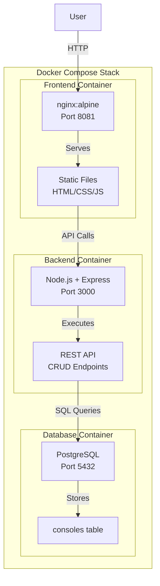

# CRUD Implementation Plan: Console Age Display

## 🎯 Project Overview

Transform the read-only static console display into a full-stack CRUD (Create, Read, Update, Delete) application with a learning-focused approach.

**Focus**: Educational implementation with extensive comments and documentation for learning web development concepts.

---

## 📋 Architecture Design



---

## 🛠️ Technology Stack

### Backend
- **Runtime**: Node.js (LTS version)
- **Framework**: Express.js 4.x
- **Database Client**: pg (node-postgres)
- **Middleware**: 
  - `cors` - Enable cross-origin requests
  - `body-parser` / `express.json()` - Parse JSON bodies
  - Custom error handler

### Frontend (Enhanced)
- **Existing**: HTML5, CSS3, Vanilla JavaScript
- **Additions**: 
  - Modal component for Create/Edit forms
  - Form validation logic
  - CRUD operation handlers
  - Toast notification system
  - Loading states

### Database
- **DBMS**: PostgreSQL 16.x
- **Schema**: Single `consoles` table
- **Persistence**: Docker volume for data retention

### Development
- **Containerization**: Docker + Docker Compose
- **Version Control**: Git
- **IDE**: IntelliJ IDEA Ultimate / VS Code

---

## 📊 Database Schema

```sql
CREATE TABLE consoles (
    -- Primary key: Auto-incrementing unique identifier
    id SERIAL PRIMARY KEY,
    
    -- Console information
    name VARCHAR(255) NOT NULL,
    manufacturer VARCHAR(255) NOT NULL,
    release_date DATE NOT NULL,
    image_url VARCHAR(512),
    
    -- Metadata: Track when records are created/modified
    created_at TIMESTAMP DEFAULT CURRENT_TIMESTAMP,
    updated_at TIMESTAMP DEFAULT CURRENT_TIMESTAMP
);

-- Index for faster sorting by release date
CREATE INDEX idx_release_date ON consoles(release_date);

-- Index for searching by manufacturer
CREATE INDEX idx_manufacturer ON consoles(manufacturer);
```

### Design Decisions:
- **SERIAL for ID**: PostgreSQL auto-increment, guarantees uniqueness
- **VARCHAR lengths**: Reasonable limits to prevent excessive data
- **DATE type**: Stores release date without time component
- **Nullable image_url**: Optional field, not all consoles need images
- **Timestamps**: Audit trail for data management

---

## 🔌 RESTful API Design

| Method | Endpoint | Description | Request Body | Response |
|--------|----------|-------------|--------------|----------|
| GET | `/api/consoles` | Get all consoles | None | Array of console objects |
| GET | `/api/consoles/:id` | Get single console | None | Single console object |
| POST | `/api/consoles` | Create new console | Console object | Created console with ID |
| PUT | `/api/consoles/:id` | Update console | Updated fields | Updated console object |
| DELETE | `/api/consoles/:id` | Delete console | None | Success message |

### Example Request/Response

**POST /api/consoles**
```json
Request:
{
    "name": "PlayStation 6",
    "manufacturer": "Sony",
    "release_date": "2027-11-15",
    "image_url": "https://example.com/ps6.png"
}

Response (201 Created):
{
    "id": 64,
    "name": "PlayStation 6",
    "manufacturer": "Sony",
    "release_date": "2027-11-15",
    "image_url": "https://example.com/ps6.png",
    "created_at": "2026-03-26T12:35:00.000Z",
    "updated_at": "2026-03-26T12:35:00.000Z"
}
```

**PUT /api/consoles/64**
```json
Request:
{
    "name": "PlayStation 6 Pro"
}

Response (200 OK):
{
    "id": 64,
    "name": "PlayStation 6 Pro",
    "manufacturer": "Sony",
    "release_date": "2027-11-15",
    "image_url": "https://example.com/ps6.png",
    "created_at": "2026-03-26T12:35:00.000Z",
    "updated_at": "2026-03-26T12:40:00.000Z"
}
```

---

## 📁 New File Structure

```
console-age/
├── backend/                          # NEW - Node.js API
│   ├── config/
│   │   └── database.js              # DB connection config
│   ├── routes/
│   │   └── consoles.js              # Console CRUD routes
│   ├── middleware/
│   │   ├── errorHandler.js          # Global error handling
│   │   └── validator.js             # Request validation
│   ├── controllers/
│   │   └── consoleController.js     # Business logic
│   ├── server.js                     # Express app entry point
│   ├── package.json                  # Node dependencies
│   ├── .dockerignore
│   └── dockerfile                    # Backend container
│
├── database/                         # NEW - SQL scripts
│   ├── init.sql                      # Schema creation
│   └── seed.sql                      # Initial data migration
│
├── public/                           # ENHANCED - Frontend
│   ├── index.html                   # Add modal, action buttons
│   ├── styles.css                   # Add modal/form styles
│   ├── script.js                    # Add CRUD operations
│   └── consoles.json                # Keep as backup/reference
│
├── memory-bank/                      # UPDATED
│   ├── projectbrief.md              # Update with CRUD goals
│   ├── productContext.md            # Update with new features
│   ├── activeContext.md             # Update current work
│   ├── systemPatterns.md            # Add API patterns
│   ├── techContext.md               # Add backend stack
│   ├── progress.md                  # Track CRUD progress
│   ├── knownIssues.md               # NEW - Bug tracking
│   └── crudPlan.md                  # NEW - This file
│
├── docker-compose.yml               # UPDATED - Add backend service
├── frontend.dockerfile              # RENAMED from dockerfile
├── .gitignore                       # UPDATE - Add node_modules
└── README.md                        # UPDATE - New setup guide
```

---

## 🎓 Learning-Focused Implementation

### Educational Approach

Since this is a learning project, the implementation will include:

1. **Extensive Inline Comments**
   - Explain *why* decisions were made, not just *what* code does
   - Reference learning concepts and patterns
   - Include links to documentation

2. **Code Examples**
   ```javascript
   /**
    * Create a new console entry
    * 
    * Learning concepts:
    * - Async/await for handling asynchronous operations
    * - Error handling with try/catch blocks
    * - HTTP status codes (201 for created)
    * - SQL injection prevention with parameterized queries
    * 
    * Related reading:
    * - https://developer.mozilla.org/en-US/docs/Web/JavaScript/Reference/Statements/async_function
    * - https://expressjs.com/en/guide/error-handling.html
    */
   async function createConsole(req, res) {
       // Implementation with detailed comments
   }
   ```

3. **Git Commit Messages with Learning Notes**
   ```
   feat(backend): Add Express server with CORS middleware
   
   Learning notes:
   - CORS needed because frontend (port 8081) calls backend (port 3000)
   - Middleware executes in order - CORS must come before routes
   - body-parser (express.json()) enables reading JSON request bodies
   - Error handling middleware must be defined last
   
   Concepts practiced:
   - Express middleware chain
   - Cross-origin resource sharing
   - RESTful API structure
   ```

4. **README Documentation**
   - "How It Works" section explaining architecture
   - "Learning Objectives" for each component
   - "Common Issues" troubleshooting guide
   - "Next Steps" for extending the project

5. **Console Logging for Development**
   ```javascript
   // Educational logging showing data flow
   console.log('📥 POST /api/consoles - Received request');
   console.log('📋 Request body:', req.body);
   console.log('✅ Validation passed');
   console.log('💾 Saving to database...');
   console.log('✨ Console created with ID:', result.id);
   ```

---

## 🔄 Implementation Phases

### **Phase 0: Bug Fixes & Foundation** (30-60 minutes)

**Objective**: Fix existing issues before adding new functionality

**Tasks**:
1. ✅ Fix sorting order in `public/script.js`
   ```javascript
   // Change from newest-first to oldest-first
   data.consoles.sort((a, b) => new Date(a.release_date) - new Date(b.release_date));
   ```

2. ✅ Update port in `docker-compose.yml` from 2480 to 8081
   ```yaml
   ports:
     - "8081:80"  # Match documentation
   ```

3. ✅ Add comments to docker-compose.yml explaining PostgreSQL service
   ```yaml
   # PostgreSQL database for CRUD functionality
   # Currently starts but unused - will be connected in Phase 2
   ```

4. ✅ Update memory bank files with current status

**Learning Objectives**:
- Understand the importance of fixing bugs before adding features
- Practice debugging workflow
- Learn to maintain documentation accuracy

---

### **Phase 1: Backend Setup** (2-3 hours)

**Objective**: Create Node.js/Express API with educational comments

#### 1.1 Initialize Backend Project (15 mins)

```bash
cd backend
npm init -y
npm install express pg cors dotenv
npm install --save-dev nodemon
```

**Files to create**:
- `package.json` with scripts
- `.dockerignore` to exclude node_modules
- `dockerfile` for backend container

**Learning Objectives**:
- Understand npm package management
- Learn about development dependencies
- Practice Docker containerization

#### 1.2 Database Configuration (20 mins)

**File**: `backend/config/database.js`

```javascript
/**
 * Database Connection Pool Configuration
 * 
 * Learning concepts:
 * - Connection pooling: Reuse database connections for efficiency
 * - Environment variables: Keep sensitive data out of code
 * - Error handling: Gracefully handle connection failures
 */

const { Pool } = require('pg');

const pool = new Pool({
    host: process.env.DB_HOST || 'db',
    port: process.env.DB_PORT || 5432,
    database: process.env.DB_NAME || 'consoleages',
    user: process.env.DB_USER || 'postgres',
    password: process.env.DB_PASSWORD || 'ChangeMe',
    // Connection pool settings
    max: 20,                    // Maximum connections in pool
    idleTimeoutMillis: 30000,   // Close idle connections after 30s
    connectionTimeoutMillis: 2000, // Timeout if can't connect
});

module.exports = pool;
```

**Learning Objectives**:
- Understand database connection pooling
- Learn environment variable usage
- Practice secure credential management

#### 1.3 Express Server Setup (30 mins)

**File**: `backend/server.js`

```javascript
/**
 * Express Server for Console Age CRUD API
 * 
 * This is the main entry point for the backend application.
 * It sets up the Express server, middleware, routes, and error handling.
 * 
 * Learning concepts:
 * - Express.js framework basics
 * - Middleware chain and order
 * - RESTful API structure
 * - Error handling patterns
 */

const express = require('express');
const cors = require('cors');
const consoleRoutes = require('./routes/consoles');
const errorHandler = require('./middleware/errorHandler');

const app = express();
const PORT = process.env.PORT || 3000;

// Middleware: Execute in order from top to bottom
// 1. CORS: Allow frontend to call backend from different origin
app.use(cors({
    origin: 'http://localhost:8081', // Frontend URL
    methods: ['GET', 'POST', 'PUT', 'DELETE'],
    credentials: true
}));

// 2. JSON Parser: Parse incoming JSON request bodies
app.use(express.json());

// 3. Logging: Log all requests for debugging (development only)
app.use((req, res, next) => {
    console.log(`${new Date().toISOString()} - ${req.method} ${req.path}`);
    next();
});

// Routes: Define API endpoints
app.use('/api/consoles', consoleRoutes);

// Health check endpoint
app.get('/health', (req, res) => {
    res.json({ status: 'ok', message: 'Backend is running' });
});

// Error handling: Must be defined AFTER all routes
app.use(errorHandler);

// Start server
app.listen(PORT, () => {
    console.log(`🚀 Backend server running on http://localhost:${PORT}`);
    console.log(`📚 API documentation: http://localhost:${PORT}/api/consoles`);
});
```

**Learning Objectives**:
- Understand Express middleware order
- Learn CORS configuration
- Practice server setup patterns

#### 1.4 Console Routes (45 mins)

**File**: `backend/routes/consoles.js`

```javascript
/**
 * Console CRUD Routes
 * 
 * RESTful API endpoints for managing console data.
 * Each route follows REST conventions for HTTP methods and status codes.
 */

const express = require('express');
const router = express.Router();
const pool = require('../config/database');

// GET /api/consoles - Read all consoles
router.get('/', async (req, res, next) => {
    try {
        // SQL query with ORDER BY for chronological sorting
        const result = await pool.query(
            'SELECT * FROM consoles ORDER BY release_date ASC'
        );
        res.json(result.rows);
    } catch (error) {
        next(error); // Pass to error handler
    }
});

// GET /api/consoles/:id - Read single console
// POST /api/consoles - Create console
// PUT /api/consoles/:id - Update console
// DELETE /api/consoles/:id - Delete console

module.exports = router;
```

**Learning Objectives**:
- Understand RESTful route design
- Learn async/await with database queries
- Practice error handling patterns
- Understand SQL injection prevention

#### 1.5 Error Handler Middleware (20 mins)

**File**: `backend/middleware/errorHandler.js`

**Learning Objectives**:
- Understand Express error handling
- Learn proper HTTP status codes
- Practice error response formatting

#### 1.6 Backend Dockerfile (15 mins)

**File**: `backend/dockerfile`

```dockerfile
# Use official Node.js LTS (Long Term Support) image
FROM node:18-alpine

# Set working directory inside container
WORKDIR /app

# Copy package files first (for Docker layer caching)
COPY package*.json ./

# Install dependencies
RUN npm install

# Copy application code
COPY . .

# Expose port 3000
EXPOSE 3000

# Start application with nodemon for development
CMD ["npm", "start"]
```

**Learning Objectives**:
- Understand Docker multi-stage builds
- Learn Docker layer caching optimization
- Practice containerization best practices

---

### **Phase 2: Database Setup** (45-60 minutes)

**Objective**: Create PostgreSQL schema and seed data

#### 2.1 Database Schema (20 mins)

**File**: `database/init.sql`

```sql
-- Console Age Database Schema
-- This script runs automatically when PostgreSQL container first starts
-- Location: /docker-entrypoint-initdb.d/init.sql

-- Drop table if exists (for clean re-initialization)
DROP TABLE IF EXISTS consoles;

-- Create consoles table
CREATE TABLE consoles (
    -- Primary Key: Auto-incrementing unique identifier
    -- SERIAL is PostgreSQL-specific, equivalent to AUTO_INCREMENT in MySQL
    id SERIAL PRIMARY KEY,
    
    -- Console Information
    name VARCHAR(255) NOT NULL,
    manufacturer VARCHAR(255) NOT NULL,
    release_date DATE NOT NULL,
    image_url VARCHAR(512),  -- Optional field
    
    -- Audit Timestamps
    -- DEFAULT CURRENT_TIMESTAMP automatically sets creation time
    created_at TIMESTAMP DEFAULT CURRENT_TIMESTAMP,
    updated_at TIMESTAMP DEFAULT CURRENT_TIMESTAMP
);

-- Indexes for Performance
-- These speed up queries that sort/filter by these columns
CREATE INDEX idx_release_date ON consoles(release_date);
CREATE INDEX idx_manufacturer ON consoles(manufacturer);

-- Sample comment explaining database design
COMMENT ON TABLE consoles IS 'Stores video game console information with release dates';
COMMENT ON COLUMN consoles.release_date IS 'Original release date in format YYYY-MM-DD';
```

**Learning Objectives**:
- Understand SQL DDL (Data Definition Language)
- Learn about indexes and performance
- Practice database design principles

#### 2.2 Data Migration Script (25 mins)

**File**: `database/seed.sql`

Script to migrate data from `consoles.json` to PostgreSQL.

**Learning Objectives**:
- Understand data migration concepts
- Learn SQL DML (Data Manipulation Language)
- Practice bulk insert operations

---

### **Phase 3: Frontend Enhancement** (3-4 hours)

**Objective**: Add CRUD UI with modals, forms, and API integration

#### 3.1 Modal HTML Structure (30 mins)

**File**: `public/index.html` (additions)

```html
<!-- Modal for Create/Edit Console -->
<div id="consoleModal" class="modal">
    <div class="modal-content">
        <div class="modal-header">
            <h2 id="modalTitle">Add Console</h2>
            <button class="close-button">&times;</button>
        </div>
        <form id="consoleForm">
            <div class="form-group">
                <label for="name">Console Name *</label>
                <input type="text" id="name" required>
            </div>
            <!-- More form fields -->
        </form>
    </div>
</div>
```

**Learning Objectives**:
- Understand modal dialog patterns
- Learn HTML5 form validation
- Practice accessible form design

#### 3.2 Modal CSS Styling (45 mins)

**File**: `public/styles.css` (additions)

**Learning Objectives**:
- Understand CSS overlay techniques
- Learn flexbox for centering
- Practice form styling patterns

#### 3.3 CRUD JavaScript Operations (90-120 mins)

**File**: `public/script.js` (major enhancements)

```javascript
/**
 * CRUD Operations for Console Management
 * 
 * This file handles all Create, Read, Update, Delete operations
 * by making API calls to the backend server.
 */

const API_BASE_URL = 'http://localhost:3000/api/consoles';

// ============================================
// CREATE Operation
// ============================================

/**
 * Create a new console entry
 * 
 * Learning concepts:
 * - HTTP POST method
 * - JSON request body
 * - Form data collection
 * - Async/await error handling
 * - HTTP status codes (201 Created)
 */
async function createConsole(consoleData) {
    try {
        // Validate data before sending (client-side validation)
        validateConsoleData(consoleData);
        
        const response = await fetch(API_BASE_URL, {
            method: 'POST',
            headers: {
                'Content-Type': 'application/json'
            },
            body: JSON.stringify(consoleData)
        });
        
        if (!response.ok) {
            throw new Error(`HTTP error! status: ${response.status}`);
        }
        
        const newConsole = await response.json();
        console.log('✅ Console created:', newConsole);
        
        // Refresh the display
        await loadConsoles();
        
        // Show success message
        showToast('Console added successfully!', 'success');
        
        return newConsole;
    } catch (error) {
        console.error('❌ Error creating console:', error);
        showToast('Failed to add console', 'error');
        throw error;
    }
}

// Similar patterns for UPDATE and DELETE operations
```

**Learning Objectives**:
- Master Fetch API usage
- Understand HTTP methods and status codes
- Learn async/await error handling
- Practice DOM manipulation
- Understand form validation

---

### **Phase 4: Integration & Testing** (1-2 hours)

**Objective**: Connect all pieces and test thoroughly

#### 4.1 Update Docker Compose (20 mins)

**File**: `docker-compose.yml` (updated)

```yaml
version: '3.8'

services:
  # Frontend: nginx serving static files
  frontend:
    build:
      context: .
      dockerfile: frontend.dockerfile
    container_name: console-age-frontend
    ports:
      - "8081:80"
    depends_on:
      - backend
    volumes:
      - ./public/:/usr/share/nginx/html/
    networks:
      - console-network

  # Backend: Node.js Express API
  backend:
    build:
      context: ./backend
      dockerfile: dockerfile
    container_name: console-age-backend
    ports:
      - "3000:3000"
    environment:
      - DB_HOST=db
      - DB_PORT=5432
      - DB_NAME=consoleages
      - DB_USER=postgres
      - DB_PASSWORD=ChangeMe
    depends_on:
      - db
    volumes:
      - ./backend:/app
      - /app/node_modules
    networks:
      - console-network

  # Database: PostgreSQL
  db:
    image: postgres:16-alpine
    container_name: console-age-db
    ports:
      - "5432:5432"
    environment:
      POSTGRES_PASSWORD: ChangeMe
      POSTGRES_DB: consoleages
    volumes:
      - db_data:/var/lib/postgresql/data
      - ./database/init.sql:/docker-entrypoint-initdb.d/01-schema.sql
      - ./database/seed.sql:/docker-entrypoint-initdb.d/02-seed.sql
    networks:
      - console-network

networks:
  console-network:
    driver: bridge

volumes:
  db_data:
```

**Learning Objectives**:
- Understand Docker networking
- Learn service dependencies
- Practice environment variables
- Understand volume mounting

#### 4.2 Testing Checklist

- [ ] **CREATE**: Add new console via form
- [ ] **READ**: View all consoles in table
- [ ] **UPDATE**: Edit existing console
- [ ] **DELETE**: Remove console with confirmation
- [ ] **Validation**: Test required fields
- [ ] **Error Handling**: Test with backend offline
- [ ] **Network**: Verify CORS working
- [ ] **Database**: Confirm data persists after restart
- [ ] **Responsive**: Test on mobile view

---

### **Phase 5: Documentation** (30-60 minutes)

**Objective**: Comprehensive learning documentation

#### 5.1 Update README.md

Sections to add:
- Architecture diagram
- Setup instructions for CRUD
- API endpoint documentation
- Development workflow
- Troubleshooting guide

#### 5.2 Update Memory Bank

Files to update:
- `activeContext.md` - Current CRUD implementation status
- `progress.md` - Mark CRUD features complete
- `systemPatterns.md` - Add backend patterns
- `techContext.md` - Add Node.js/PostgreSQL info

#### 5.3 Create Learning Notes

**New file**: `LEARNING_NOTES.md`

Document key learnings:
- RESTful API design principles
- Full-stack development workflow
- Database integration patterns
- Error handling strategies
- Testing approaches

---

## ⚡ Key Learning Objectives

### Backend Development
- ✅ Express.js middleware patterns
- ✅ RESTful API design conventions
- ✅ Database connection pooling
- ✅ Async/await with error handling
- ✅ SQL query writing and parameterization
- ✅ CORS configuration

### Frontend Development
- ✅ Fetch API for HTTP requests
- ✅ Modal UI patterns
- ✅ Form validation (client-side)
- ✅ DOM manipulation techniques
- ✅ Event handling
- ✅ User feedback (toasts/notifications)

### Full-Stack Integration
- ✅ Docker multi-container orchestration
- ✅ Service-to-service communication
- ✅ Environment variable management
- ✅ Development vs production configuration
- ✅ Debugging distributed systems

### Database Management
- ✅ Schema design
- ✅ Indexes for performance
- ✅ Data migrations
- ✅ CRUD SQL operations
- ✅ Transaction handling

---

## 🎯 Success Criteria

- [ ] Backend API responds to all CRUD endpoints
- [ ] Frontend can create new console entries
- [ ] Frontend can edit existing consoles
- [ ] Frontend can delete consoles with confirmation
- [ ] Data persists in PostgreSQL database
- [ ] All changes survive container restart
- [ ] Error handling provides user feedback
- [ ] Form validation prevents invalid data
- [ ] Responsive design maintained
- [ ] Code heavily commented for learning
- [ ] Documentation comprehensive and clear
- [ ] Git history shows learning progression

---

## 🚀 Future Enhancements

### After Basic CRUD
- [ ] Search/filter functionality
- [ ] Sort by different columns
- [ ] Pagination for large datasets
- [ ] Image upload functionality
- [ ] Bulk operations (import/export)

### Advanced Features
- [ ] Authentication/authorization
- [ ] User accounts and roles
- [ ] Activity logging
- [ ] API rate limiting
- [ ] Caching layer (Redis)
- [ ] GraphQL alternative API

### TypeScript Migration
- [ ] Convert backend to TypeScript
- [ ] Convert frontend to TypeScript
- [ ] Add type definitions
- [ ] Set up build process
- [ ] Implement interfaces

---

## 📚 Additional Resources

### Documentation
- [Express.js Guide](https://expressjs.com/en/guide/routing.html)
- [PostgreSQL Tutorial](https://www.postgresql.org/docs/current/tutorial.html)
- [REST API Design](https://restfulapi.net/)
- [MDN Fetch API](https://developer.mozilla.org/en-US/docs/Web/API/Fetch_API)

### Learning Paths
- Node.js fundamentals
- SQL and database design
- RESTful API principles
- Docker containerization
- Full-stack development patterns

---

## 🤝 Implementation Notes

### Development Workflow
1. Create feature branch from main
2. Implement phase sequentially
3. Test after each phase
4. Commit with detailed messages
5. Update documentation continuously
6. Merge when phase complete

### Git Commit Strategy
- Prefix: `feat`, `fix`, `docs`, `refactor`, `test`
- Include learning notes in commit body
- Reference relevant files and concepts

### Code Review Points
- Is the code readable and well-commented?
- Do comments explain *why*, not just *what*?
- Are error cases handled gracefully?
- Is the user experience smooth?
- Does it demonstrate the learning concept?

---

**Plan Created**: 2026-03-26  
**Target Start**: After bug fixes  
**Estimated Duration**: 8-12 hours total  
**Learning Level**: Intermediate  
**Prerequisites**: Basic JavaScript, HTML, CSS knowledge
